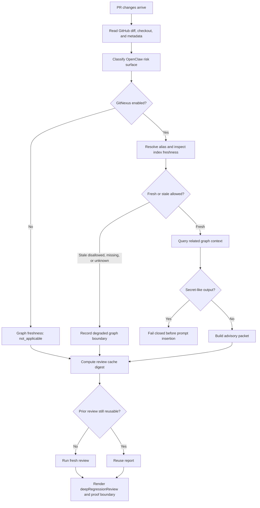

# Deep Regression Review Prototype

Read when: enabling or reviewing the default-off OpenClaw deep-regression
review path, GitNexus advisory context, context-window telemetry, or the
`deepRegressionReview` decision field.

## TLDR

The prototype adds an independent high-risk PR pass for OpenClaw core,
runtime, auth, session, security, provider-routing, release automation, and
configuration-default changes.

It is default-off. GitHub diff and checkout data remain authoritative. GitNexus
is advisory context only. Stale, missing, or unsafe graph context lowers
confidence instead of being treated as proof.

## Why This Exists

Normal CI can pass while a PR still chooses the wrong architecture, duplicates
an existing path, patches around a broken assumption, or creates a hidden
regression in core runtime behavior. This lane gives ClawSweeper a place to say
that explicitly and to separate "tests passed" from "this is safe to build on."

The immediate cost-saving goal is better cache and context hygiene:

- reuse a prior review only when code inputs and graph-context inputs match;
- avoid spending model tokens on repeated reviews of identical graph context;
- make stale or missing graph context visible instead of burying uncertainty in
  prose;
- avoid public claims about a specific context-window size.

## Enabling Flags

```sh
CLAWSWEEPER_GITNEXUS_CONTEXT=1
CLAWSWEEPER_GITNEXUS_ALIAS_OPENCLAW=openclaw
CLAWSWEEPER_GITNEXUS_INCLUDE_STALE=0
CLAWSWEEPER_EXPECTED_CONTEXT_WINDOW_TOKENS=1000000
```

`CLAWSWEEPER_GITNEXUS_CONTEXT=1` enables packet building for OpenClaw PR
reviews. If the flag is absent, the graph path is disabled and the review must
record graph freshness as `not_applicable`.

`CLAWSWEEPER_GITNEXUS_INCLUDE_STALE=0` is the safe default. A stale index may
be recorded, but stale related context is not inserted into the prompt unless a
maintainer explicitly opts into that tradeoff.

`CLAWSWEEPER_EXPECTED_CONTEXT_WINDOW_TOKENS` is telemetry only. If it is absent,
reports say `unknown`; ClawSweeper must not imply that a 1M-token context window
is available.

## Review Flow



## GitNexus In Plain English

GitNexus is a code graph/index. In this prototype ClawSweeper asks it for
related-code hints for changed files. The packet can help answer:

- Which files or symbols are nearby?
- What related paths might depend on this area?
- Is the graph fresh enough to trust as review context?
- What context was omitted because it was stale, too large, generated, empty, or
  unsafe?

GitNexus never replaces the PR diff. It also never makes a PR release-ready by
itself. It is a source of hints that ClawSweeper must describe with freshness
and proof boundaries.

## Packet Integrity

The packet has two hashes with different jobs:

- `sha256`: exact packet hash, including run-local fields such as
  `generatedAt`; use this for evidence traceability.
- `contentSha256`: stable graph-content hash, excluding run-local packet
  telemetry; use this for review-cache state.

The review cache uses `contentSha256` so identical graph context generated at
different times can reuse the prior review. Changed graph output, changed graph
freshness, changed stale-policy, or changed expected context-window telemetry
still busts the review digest.

## Failure Boundaries

| Case | Behavior |
| --- | --- |
| GitNexus disabled | Continue without graph context and record `not_applicable`. |
| Alias missing | Continue degraded and record `missing`. |
| Index stale and stale context disabled | Continue degraded and omit related context. |
| `gitnexus list` or `gitnexus query` fails | Record command status plus output hash; omit raw stdout/stderr. |
| Secret-like list/query output | Fail closed before prompt insertion. |
| Packet exceeds byte budget | Omit lower-priority related context and record what was omitted. |
| Context window unknown | Record `unknown`; do not imply 1M-context support. |

## Output Contract

Every review decision includes `deepRegressionReview`.

For standard or docs-only work, the field may be quiet:

```json
{
  "status": "not_applicable",
  "riskLevel": "standard",
  "surfaceCategories": ["docs_only"],
  "graphContextUsed": false,
  "graphContextFreshness": "not_applicable",
  "concerns": [],
  "requiredMaintainerAction": ""
}
```

For high-risk work, ClawSweeper must independently check architecture fit,
duplicate paths, shallow fixes, runtime assumptions, and hidden regressions. It
should use `needs_attention` or `blocked` when a maintainer needs to redesign,
prove, or explicitly accept the risk before merge.

## Maintainer Decision Proposed By This PR

This PR proposes that the default-off contract is acceptable in core when all of
these remain true:

- GitHub diff and checkout data stay authoritative.
- GitNexus context is advisory and freshness-scoped.
- Stale or missing graph context lowers confidence.
- Secret-like graph or command output fails closed.
- Public reports show the proof boundary instead of claiming release safety.
- Context-window size is telemetry only.
- The review cache uses stable graph-content state for cost savings.

Maintainers can narrow the feature later by disabling packet insertion while
keeping deterministic high-risk classification and context-window telemetry.

## Proof Checklist Before Default Enablement

Before enabling this in production for OpenClaw, collect a redacted evidence
packet with:

- default-off review run showing graph context is not attempted;
- graph-enabled run with missing or stale GitNexus context showing degraded
  freshness and no false "fresh" claim;
- graph-enabled run with fresh context showing rendered packet freshness,
  packet hash, content hash, and omitted-context accounting;
- secret-like GitNexus output fixture proving fail-closed behavior;
- high-risk auth/core fixture producing `needs_attention` or `blocked`;
- docs-only fixture proving the lane stays quiet and does not block;
- review-cache fixture proving identical graph context generated at different
  times reuses the same content digest while changed graph output busts cache;
- remote CI pass for the full check suite.

## Local Proof Commands

Use focused local checks first:

```sh
pnpm run build
node --test test/gitnexus-context.test.ts test/review-content-cache.test.ts test/decision-parser.test.ts
pnpm run format:check
pnpm run lint:src
git diff --check
```

For a committed branch, run an advisory local-range review when model-cost and
time budget allow:

```sh
CLAWSWEEPER_GITNEXUS_CONTEXT=1 \
CLAWSWEEPER_GITNEXUS_ALIAS_OPENCLAW=openclaw \
CLAWSWEEPER_GITNEXUS_INCLUDE_STALE=0 \
CLAWSWEEPER_EXPECTED_CONTEXT_WINDOW_TOKENS=1000000 \
pnpm run review -- --local-range \
  --target-repo openclaw/clawsweeper \
  --base origin/main \
  --artifact-dir /Volumes/LEXAR/Codex/evidence/clawsweeper-deep-regression/2026-07-09/local-range
```

Do not run `apply-artifacts` or `apply-decisions` for proof-only local-range
reviews.
